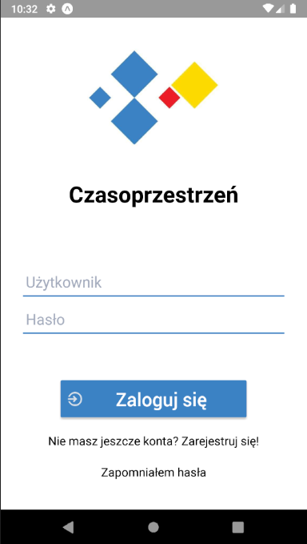
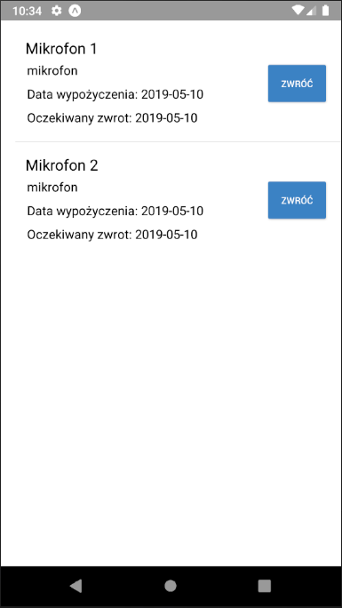
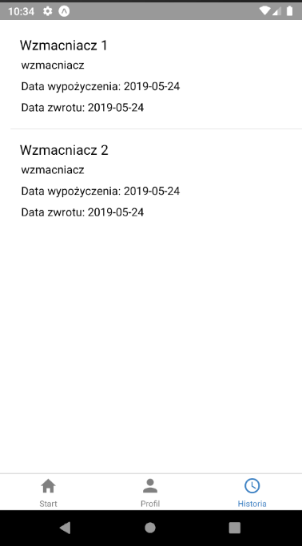
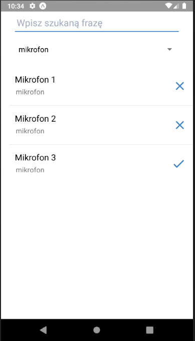
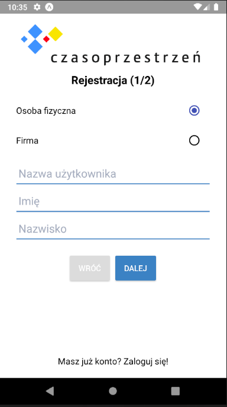

# Scanning application

Scanning application is system designed and devloped for Czasoprzestzeń to improve managemant of warehouse with musical equipment. The main functionality of this system is using QRCodes to identify every item in magazine.

(You can find detailed READme for every component of system in folders with source codes.)

#### It is only part of project developed by me. Other parts are on private repository which maybe could be make public in the future.

## Mobile part

### Technology stack
- React Native
- NativeBase
- Expo

Mobile application id intended for clients. They can use it to rent or return equipment with scanning QRCodes attached to every item. Also they can change their profile data or check when they should return rented items to warehous.

It's part of of the project developed by me.

## Frontend part
(on private repository)

### Technology stack
- React 
- Material Design 

Frontend application is designed for administrators to manage items in warehouse and clients' accounts in simple way.

## Backend part
(on private repository)

### Technology stack
- Django
- MariaDB

Backend is implemented in **Django** framework for Python. It uses REST API to communicate with other parts of system.
